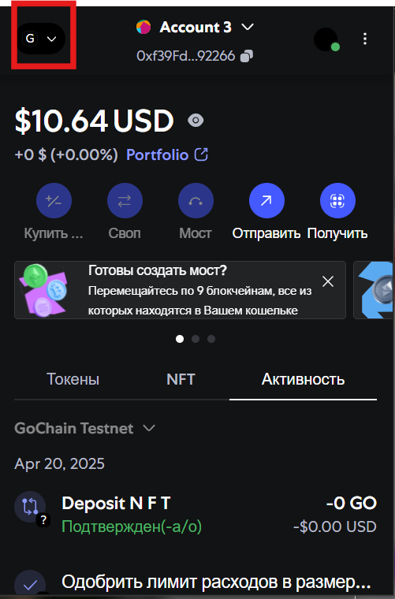
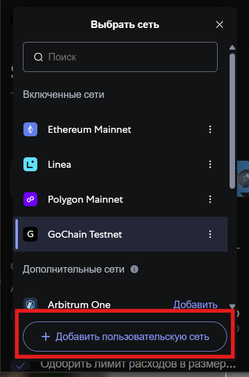
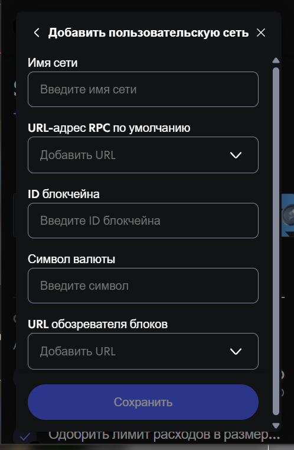
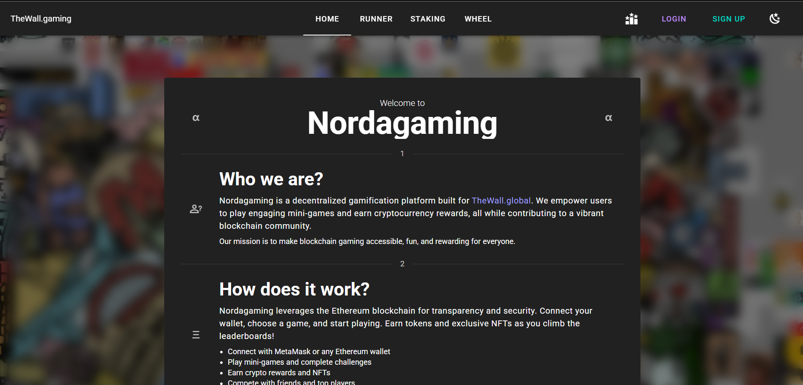
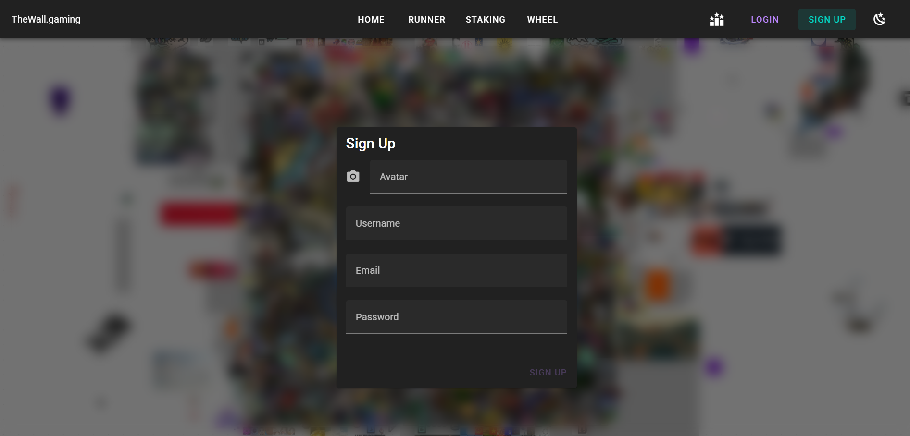
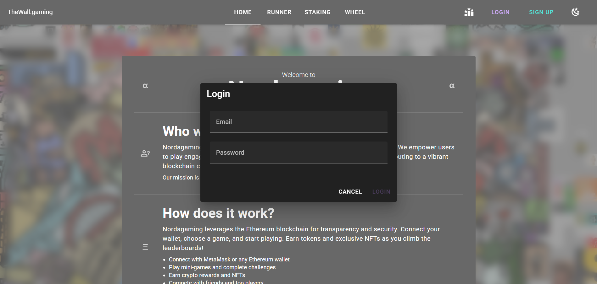
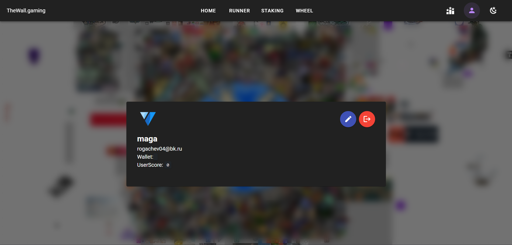
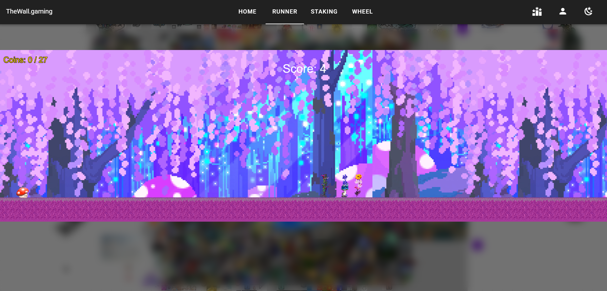
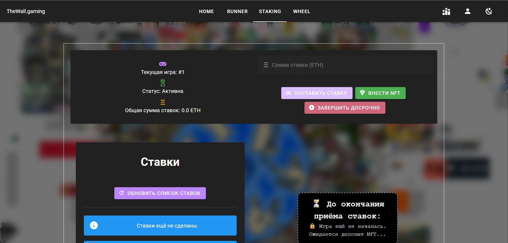
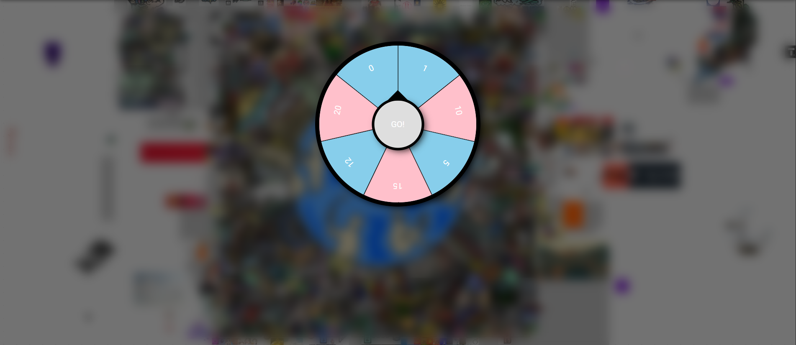

# 🎮 Nordagaming | Gamification Platform


Геймифицированная платформа для взаимодействия с on-chain контентом в сети Polygon. Разработана для [thewall.global](https://thewall.global) с использованием Vue 3 (Vite), Solidity и Node.js.

## 🌟 Особенности
- Взаимодействие с NFT и токенами
- Геймификация через смарт-контракты
- Поддержка MetaMask и Web3.js
- Локальная разработка с Hardhat Network

## 🛠 Требования
- [Node.js](https://nodejs.org/) v18+
- [Git](https://git-scm.com/)
- [MetaMask](https://metamask.io/) (рекомендуется Chrome)
- [Yarn](https://yarnpkg.com/) (опционально)

## 🚀 Установка и запуск

# 1. Клонирование репозитория
```bash
git clone https://github.com/NONAMEGG/nordagaming.git
cd nordagaming
```

# 2. Установка зависимостей

Для серверной части (Node.js):
```bash
cd server
npm install
```

Для клиентской части (Vue/Vite):
```bash
cd nordagaming
npm install
```

# 3. Установка и настройка MetaMask

#### Для Chrome/Brave:
1. Установите [расширение MetaMask](https://metamask.io/download/)
2. Создайте новый кошелек или импортируйте существующий (для тестов можно использовать seed-фразу от локальной ноды)

#### Настройка сети Hardhat:
1. Откройте расширение MetaMask
2. В верхнем выпадающем списке сетей выберите _"Add network" → "Add a network manually"_
3. Заполните параметры:

| Параметр           | Значение                     |
|--------------------|------------------------------|
| Network Name       | `GoChain Testnet`          |
| New RPC URL        | `http://127.0.0.1:8545`     |
| Chain ID           | `31337`                      |
| Currency Symbol    | `GO`                        |
| Block Explorer URL | (оставьте пустым)            |

4. Нажмите _"Save"_

🔹 **Важно!** Убедитесь что:
- Hardhat node запущен (`GoChain Testnet`)
- В MetaMask выбран созданный профиль "Hardhat Localhost"
- На аккаунте есть тестовые GO (автоматически доступны в локальной сети)

<div style="display: flex; flex-direction: column; gap: 20px; align-items: left;">







</div>

# 4. Запуск проекта
В терминале 1: Локальная нода Hardhat
```bash
cd nordagaming
npx hardhat node
```
После запуска ноды в получите приватные ключи тестовых аккаунтов, которые нужно будет добавить в Metamask
выберите _"Добавить счет или аппаратный кошелек" → "Закрытый ключ"_

В терминале 2: Серверная часть
```bash
cd server
npm start
```

В терминале 3: Деплой контрактов
```bash
#Контракт для ставок
npx hardhat run scripts/deploy.js --network localhost
#Контракт для ранера
npx hardhat run scripts/deploy.cjs --network localhost
```

Запуск приложения 
```bash
npm run dev
```

Сервер будет доступен по лоакльному адресу

# 5.Начало работы с приложением

## После запуска вы увидите главную страницу приложения:

<div style="display: flex; flex-direction: column; gap: 20px; align-items: left;">

</div>

## Страница регистрации:

## Здесь нужно заполнить данные и придумать пароль для входа в аккаунт

<div style="display: flex; flex-direction: column; gap: 20px; align-items: left;">

</div>

## Страница входа:

<div style="display: flex; flex-direction: column; gap: 20px; align-items: left;">

</div>

## После входа можно будет просматривать профиль и таблицу лидеров - 

<div style="display: flex; flex-direction: column; gap: 20px; align-items: left;">

</div>

# 🏃‍♂️ 6. Runner - Игра по сборке NFT-кластеров

### 🎮 Суть игры
**Runner** - это игровой модуль, где участники:
- Собирают части **NFT-кластеров** во время прохождения
- При получении определенного количества фрагментов:
  - 🖼️ **Эксклюзивное NFT** в коллекцию
  - 💰 **Криптовалютное вознаграждение** (в нативных токенах платформы)

### 🔍 Как играть
1. **Старт игры**:
   - Нажмите "Click to start" в главном меню

2. **Геймплей**:
   - Управление: пражок "Space"
   - Собирайте части кластеров
   - Избегайте препятствий

3. **Победа**:
   - Соберите все 27 частей (см. индикатор "Coins: X/27")
   - При успехе автоматически получаете:
     - NFT в ваш кошелек
     - Токены на баланс аккаунта

<div style="display: flex; flex-direction: column; gap: 20px; align-items: left;">

</div>

# 🎲 7. Staking - Система ставок с NFT

<div style="display: flex; flex-direction: column; gap: 20px; align-items: left;">

</div>

### 🏦 Механика ставок

#### 🔹 Для владельцев NFT:
1. Внесите NFT в контракт через кнопку **"ВНЕСТИ NFT"**
2. Установите:
   - Период приёма ставок (24-72 часа)
   - Минимальную ставку 0.01 ETH
3. NFT блокируется до окончания раунда

#### 🔹 Для участников:
1. Введите сумму ставки в ETH через **"ПОСТАВИТЬ СТАВКУ"**
2. Подтвердите транзакцию в MetaMask

### 🏆 Система наград

| Роль          | Награда                                                                 |
|---------------|-------------------------------------------------------------------------|
| Победитель    | 90% от общего пула + выставленный NFT                                   |
| Проигравшие  | Возврат 100% ставки (газ не возвращается)                              |
| Платформа     | 10% комиссия от пула                                                   |

### 📊 Формула выигрыша
Вероятность победы рассчитывается по формуле:

Пример расчета:
```math
При ставке 1 ETH в пуле 10 ETH → шанс 10%
```

# 🎡 8. Wheel of Fortune - Колесо удачи

<div style="display: flex; flex-direction: column; gap: 20px; align-items: left;">

</div>

### 🎯 Механика игры
- **Крутите колесо** - получайте случайное количество очков
- **Накопительные очки** - суммируются в ваш общий рейтинг
- **Топ-игроки** - лучшие участники получают еженедельные NFT-награды

### 🕹 Как играть
1. Нажмите **"GO"** в интерфейсе колеса
2. Получите результат:
